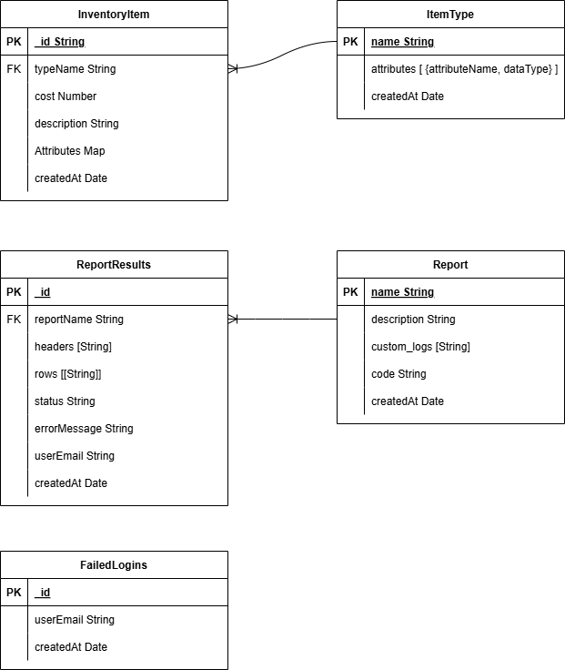
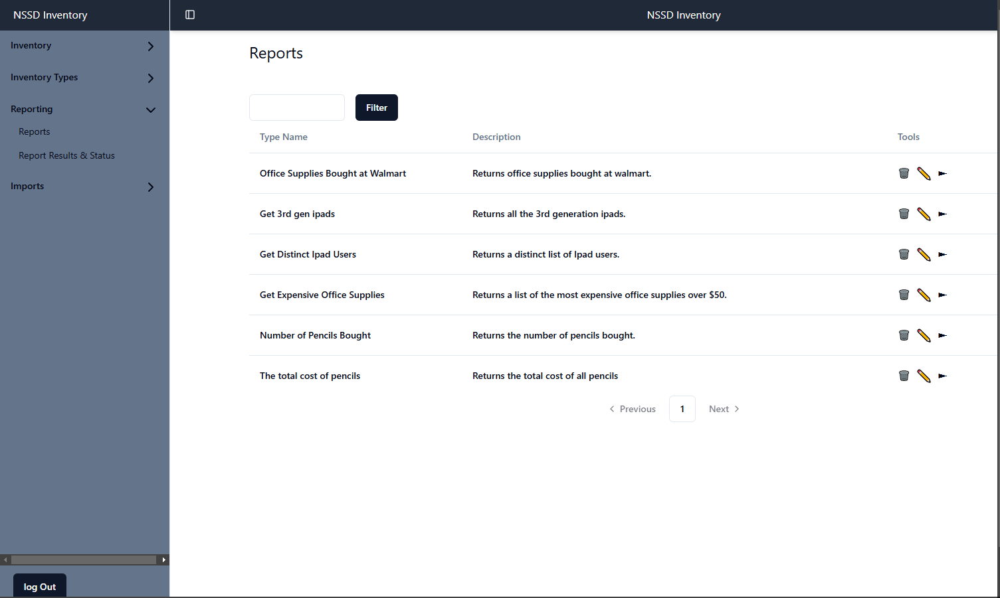

# Build and install
File io appears to be too slow on windows, so I had to make a profile that creates docker images for the front-end and node api.
- Make sure ports 4000 and 5173 are open.
### Running On Macos 
```
docker-compose  --profile macos up -d
```
### Running On Windows
```
docker-compose --profile windows up -d
```
- Go to http://localhost:5173
- Login with any email and any password. Just make sure it is a valid formatted email. 

# Diagrams

Things to note about my schema:
- Every InventoryItem must implement an ItemType through having its defined attributes.
- Report results are linked to reports by reportName, so you can filter the results of a reports by its report name.
- Queries are actually stored in the database as reports. The code is a query. They are evaluated at run time and results are stored in rows and columns. 

# Queries

Things to note about queries:
- Queries and reports can be run from the svelte frontend. Just go to reports, then the pencil button views the report, and the play button runs the report. 
- I implemented my own reports framework where report code gets saved on the database and run in worker_threads on demand. The report code has to save its results into predefined variables "header" and "rows" so the data can be viewed later.

I created 5 reports/queries:
- Office Supplies Bought at Walmart  
```javascript 
    (async ()=> 
    {
        // query the database
        let results = await inventoryModel.find({"typeName": "Office Supplies", "description":"bought from walmart."})	
        
        // Save results to header and rows
        header.push("description", "cost", "type")
        for (let result of results){
            rows.push([result.description, `${result.cost}`, result.attributes.get('type')])
        }
    })()
```
- Get 3rd gen ipads
```javascript
        (async ()=> 
        {
            // query the database
            let results = await inventoryModel.find({"typeName": "Ipad", "attributes.type":"ipad 3rd gen"})	
            
            // Save results to header and rows
            header.push("type", "cost", "description", "user")
            for (let result of results){
                rows.push([result.attributes.get('type'), `${result.cost}`, result.description, result.attributes.get('user')])
            }

        })()
```
- Get Distinct Ipad Users
```javascript
        (async ()=> 
        {
            // query the database 
            let results = await inventoryModel.distinct("attributes.user", {"typeName": "Ipad"})	
            
            // save the results to header and rows
            header.push("Ipad Users")
            for (let result of results){
                rows.push([result])
            }
        })()
```
- Get Expensive Office Supplies
```javascript
        (async ()=> 
        {
            // query the database
            let results = await inventoryModel.find({"typeName": "Office Supplies", "cost":  { $gte: 50 }})	
            
            // Save the results to header and rows
            header.push("description", "cost", "type")
            for (let result of results){
                rows.push([result.description, `${result.cost}`, result.attributes.get('type')])
            }

        })()
```
- Number of Pencils Bought
```javascript
(async ()=> 
{
    let results = await inventoryModel.countDocuments({"typeName": "Office Supplies", "attributes.type":"pencils"})	
    header.push("Pencil Count")
    rows.push([results])
})()
```
# Executive Summary
For my project I decided to build an inventory app. My stack includes a Mongodb database, a node.js API, and a svelte kit frontend. The API interacts with the database using Mongoose, and is authenticated with JSON Web tokens. Currently any email and password will authenticate because I have it set to return a token no matter what. My svelte front-end makes api calls to populate the database, run queries/reports, and display inventory data. My project is hosted with docker-compose and is super easy to run. That being said, nothing has been built for production, it is only running development servers. That shouldn't stop you from viewing the svelte front-end on localhost. 

## Use Case
The goal of this inventory app is to help keep track of the assets at the school district I work at. To that end, I chose Mongodb as the database because I thought it would be fun to work with, honestly it was. Treating everything like it is an object is wonderful, and I even like writing queries with javascript. Being in a production environment, node.js has also been super easy to work with because it isn't so ridged. For instance, I decided it would be nice to write logs to my report results, all I had to do was add "console_logs" to the reportResults model and then it was just there. In a traditional RDMS I would have had to create a whole new table. 